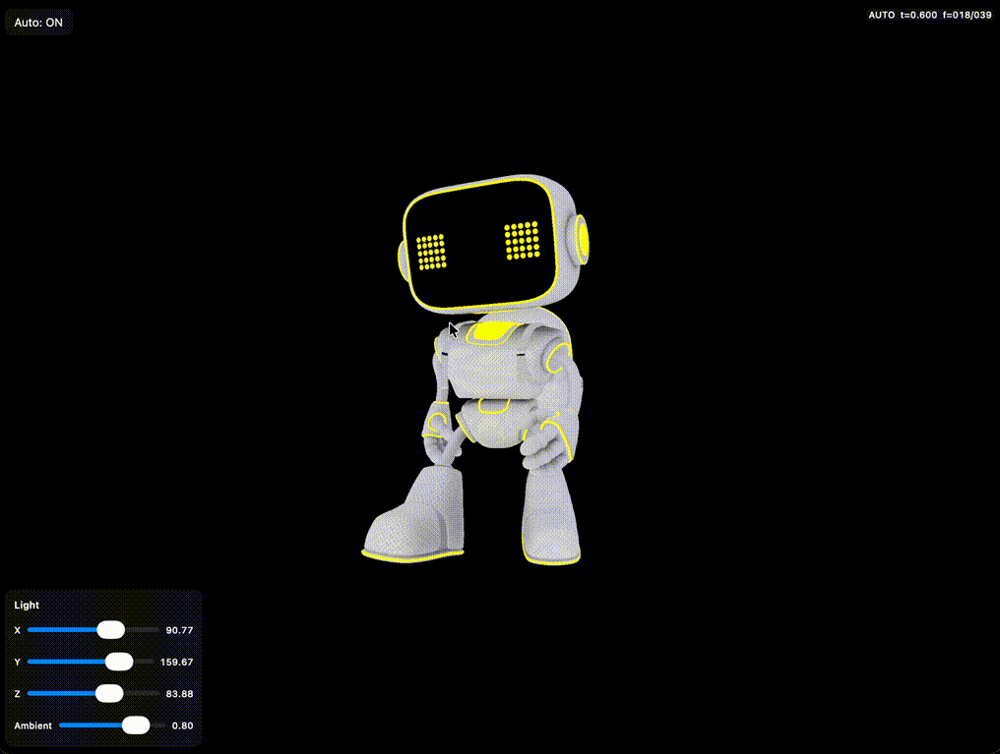

# MetalSkinnedMesh

Sample project that loads USDZ with pure Metal and plays skinned mesh animation.

## Features

- Load USDZ via Model I/O and render with MTKMesh
- Skinned Mesh Animation (MDLAnimationBindComponent / MDLPackedJointAnimation)
- PBR (BaseColor / Normal / Metallic / Roughness / AO / Emissive / Opacity)
- GameLoop-style system composition (SceneManager / Renderer / Camera / Lighting / Animation)
- UI controls for light position and ambient
- Orbit camera via drag gesture

## How to Run

1. Open `MetalSkinnedMesh.xcodeproj` in Xcode
2. Select a device or simulator and Run

> A Metal-capable iOS device is recommended

## Controls

- Drag on screen: orbit camera
- “Auto” button: toggle auto animation
- “Step +” button: advance one frame (when Auto is OFF)
- Keyboard left/right: step backward/forward (iPad + keyboard)
- Light panel (bottom-left):
  - X / Y / Z: light position (stops orbit when adjusted)
  - Ambient: ambient intensity

## Structure

- `MetalSkinnedMesh/Renderer.swift`
  - MTKViewDelegate, command buffer management
- `MetalSkinnedMesh/SceneManager.swift`
  - Game / Render system orchestration
- `MetalSkinnedMesh/Component/CameraSystem.swift`
  - Orbit camera
- `MetalSkinnedMesh/Component/LightingSystem.swift`
  - Light orbit + UI parameters
- `MetalSkinnedMesh/Component/ModelAnimationSystem.swift`
  - USDZ loading, skinning, PBR, rendering
- `MetalSkinnedMesh/Shaders.metal`
  - Vertex / Fragment (PBR)

## Assets

- `Model/robot.usdz` (sample model)

## Notes

- If normals are missing, they are generated on load (CPU-side).
- Light color/intensity can be tuned in `LightingSystem`.

## License

- This repository is licensed under the MIT License. See the `LICENSE` file at the project root for details.
- The model files inside the `Model` directory include a separate license. Please refer to [Model/LICENSE.txt](Model/LICENSE.txt) for the model-specific terms and conditions.
